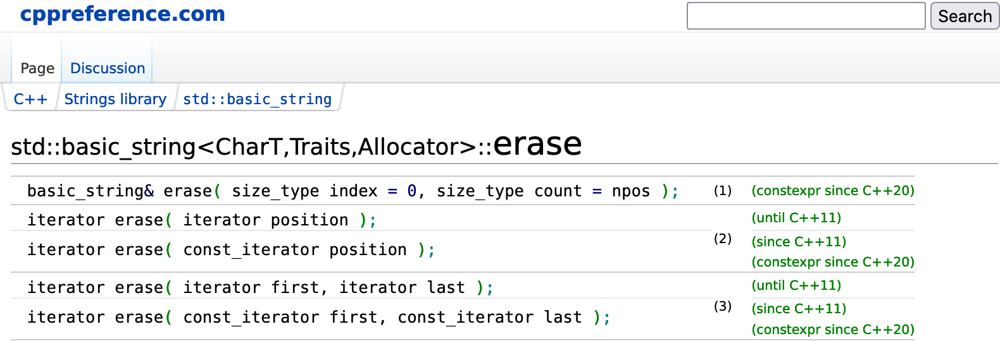
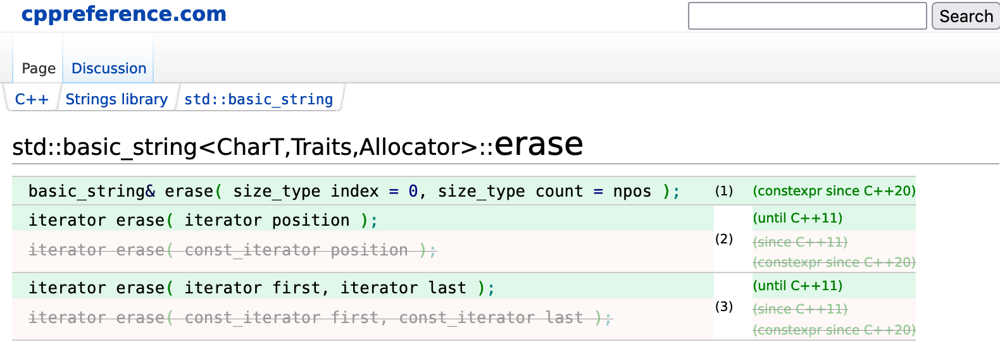

this extension makes the declarations block in [cppreference.com](https://en.cppreference.com/) more readable, especialy for checking for cpp98 compatibility

| Before | After |
| :---: | :---: |
|  |  |
